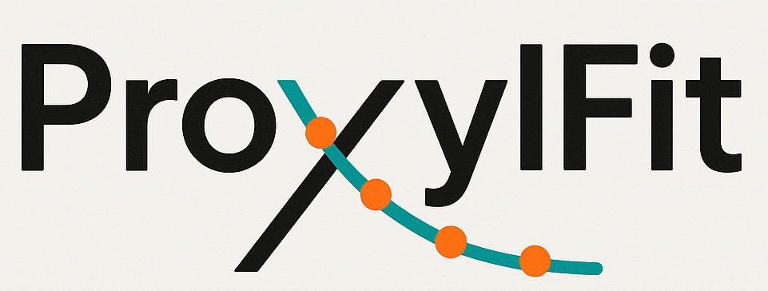

# ProxylFit: Dynamic MRI Kinetic Analysis

ProxylFit is a comprehensive Python toolkit for analyzing time-resolved MRI data after Proxyl contrast injection. The software provides robust image registration, interactive ROI selection, and sophisticated kinetic modeling capabilities.

## Overview

ProxylFit implements an **extended kinetic model** to analyze Proxyl contrast dynamics in MRI data:

```
I(t) = A0 + A1*(1 - exp(-kb*(t - t0))) * exp(-kd*(t - t0)) + A2*(1 - exp(-knt*(t - tmax)))
```

### Key Features

- **Image Registration**: Rigid registration of 4D time series data with quality metrics
- **Interactive ROI Selection**: Multiple modes including rectangular, manual contour drawing, and SegmentAnything-based segmentation
- **Extended Kinetic Modeling**: Fits tracer dynamics with non-tracer effects
- **Parameter Mapping**: Spatial parameter maps using sliding window analysis
- **Accept Button Workflows**: Intuitive GUI interactions with explicit accept buttons
- **70-Second Time Intervals**: Optimized for typical Proxyl acquisition protocols

## Quick Start

```bash
# Basic analysis with manual contour ROI selection
python run_analysis.py --dicom data.dcm --z 4

# Analysis with SegmentAnything segmentation
python run_analysis.py --dicom data.dcm --z 4 --roi-mode segment

# Create parameter maps with custom window size
python run_analysis.py --dicom data.dcm --z 4 --create-parameter-maps --window-size 7
```

## Extended Kinetic Model

### Parameters

| Parameter | Description | Units |
|-----------|-------------|-------|
| **A0** | Baseline signal | Intensity |
| **A1** | Tracer signal amplitude | Intensity |
| **A2** | Non-tracer effect amplitude | Intensity |
| **kb** | Buildup rate constant | 1/min |
| **kd** | Decay rate constant | 1/min |
| **knt** | Non-tracer effect rate constant | 1/min |
| **t0** | Tracer injection time | minutes |
| **tmax** | Non-tracer effect onset time | minutes |

### Model Components

1. **Baseline**: `A0` - constant background signal
2. **Tracer Term**: `A1*(1 - exp(-kb*(t - t0))) * exp(-kd*(t - t0))` - contrast buildup and decay
3. **Non-tracer Term**: `A2*(1 - exp(-knt*(t - tmax)))` - physiological effects

## Timing Protocol

- **Timestep**: 70 seconds per timepoint
- **Display Units**: Minutes (70 sec = 1.167 min)
- **Acquisition**: Optimized for dynamic Proxyl MRI protocols

## Module Documentation

- [**Registration**](REGISTRATION.md) - Image registration and quality assessment
- [**ROI Selection**](ROI_SELECTION.md) - Interactive region of interest tools
- [**Kinetic Fitting**](KINETIC_FITTING.md) - Extended model fitting and analysis
- [**Parameter Mapping**](PARAMETER_MAPPING.md) - Spatial parameter map generation

## Installation

### Basic Dependencies
```bash
pip install numpy scipy matplotlib SimpleITK
```

### Optional Dependencies
```bash
# For SegmentAnything ROI selection
pip install segment-anything opencv-python

# For enhanced visualization
pip install seaborn plotly
```

## Workflow

1. **Load DICOM Data** - Import 4D time series MRI data
2. **Registration** - Rigid alignment across timepoints with quality visualization
3. **ROI Selection** - Interactive selection using multiple methods
4. **Injection Time Selection** - Define contrast injection timepoint
5. **Kinetic Fitting** - Extended model parameter estimation
6. **Parameter Mapping** (optional) - Spatial parameter distribution analysis
7. **Results Export** - Comprehensive results and visualization

## GUI Features

All interactive components now use **Accept buttons** instead of "close window" workflows:

- **Registration Viewer**: "Accept Registration" button
- **ROI Selection**: "Accept ROI" button  
- **Injection Time**: "Set Injection Time" button
- **Export Functionality**: CSV export with "Export CSV" button

## Output Files

### Per-Analysis Results
- `kinetic_results.txt` - Complete parameter summary
- `timeseries_data.npz` - Raw and fitted data
- `kinetic_fit.png` - Visualization plots
- `timecourse_data.csv` - Exportable timecourse data

### Registration Data
- `registered_4d_data.npz` - Registered 4D dataset
- `registration_metrics.json` - Quality metrics and metadata

### Parameter Maps
- `parameter_maps_*.npz` - Spatial parameter distributions
- Visualization plots for each parameter

## Example Complete Workflow

```bash
python run_analysis.py \
    --dicom tumor_data.dcm \
    --z 5 \
    --roi-mode contour \
    --create-parameter-maps \
    --window-size 7 \
    --output-dir ./results
```

This produces:
- ROI-specific kinetic parameters from manual contour selection
- Spatial parameter maps across the entire image
- Comprehensive quality metrics and visualizations

## Advanced Usage

### Auto-Loading Previous Registration
```bash
python run_analysis.py --dicom data.dcm --z 4 --auto-load
```

### Batch Processing
```bash
python run_analysis.py --dicom data.dcm --z 4 --no-plot --auto-load
```

### Custom Window Sizes for Parameter Mapping
```bash
python run_analysis.py --dicom data.dcm --z 4 \
    --create-parameter-maps \
    --window-size-x 5 --window-size-y 5 --window-size-z 3
```

---

**ProxylFit Version**: Extended Model Implementation  
**Last Updated**: November 2024  
**Compatible**: Python 3.7+
