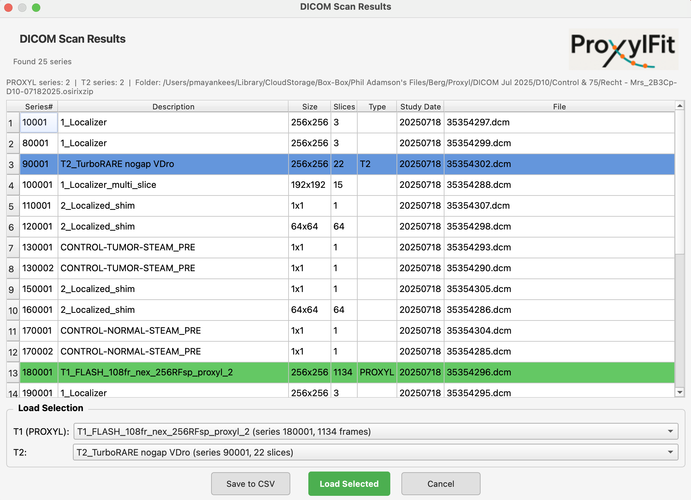
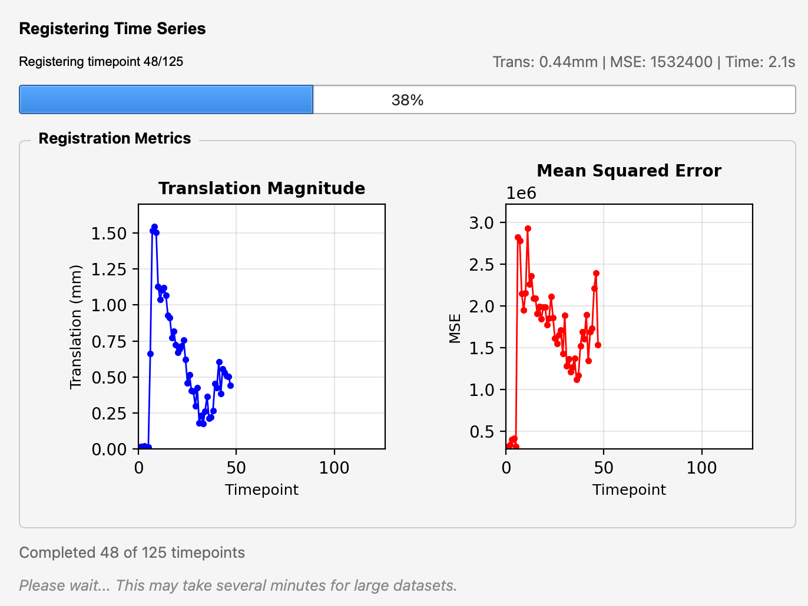
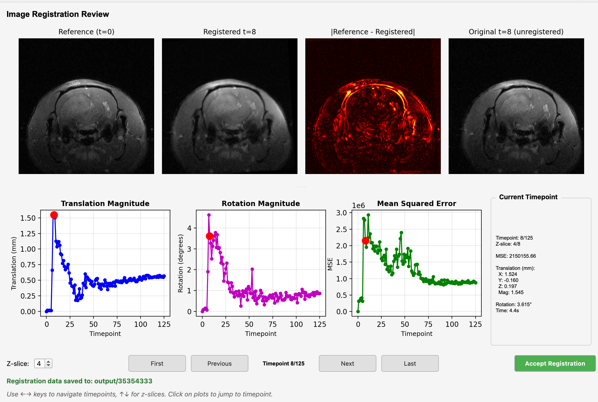
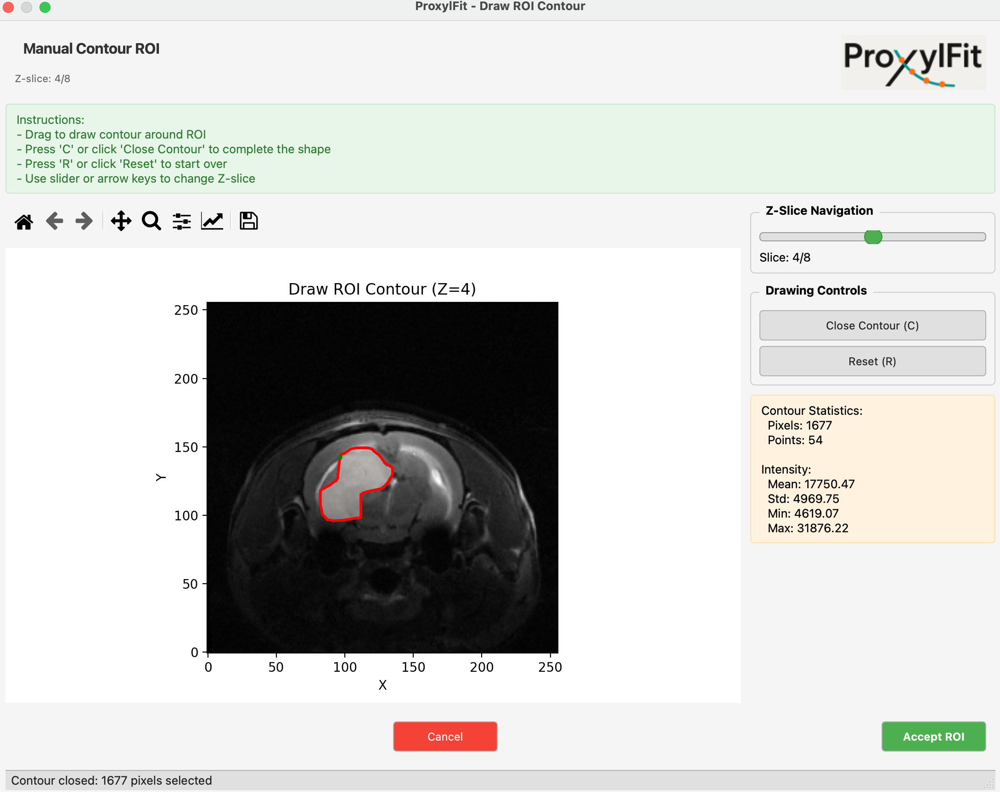
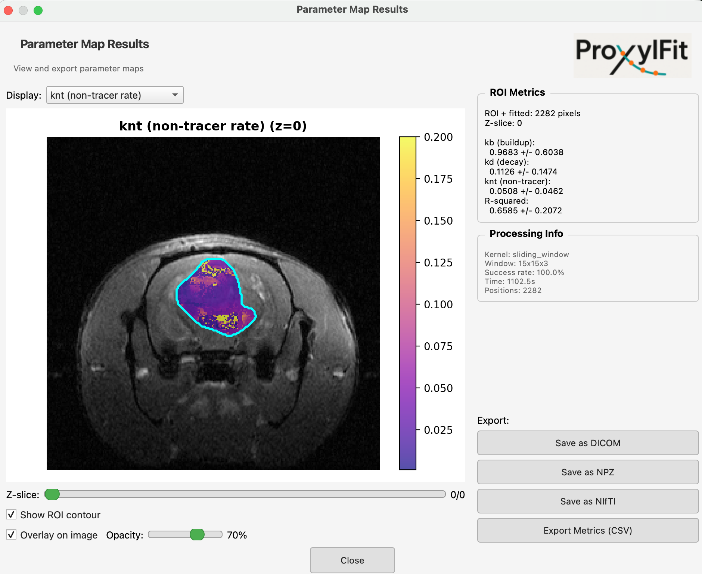
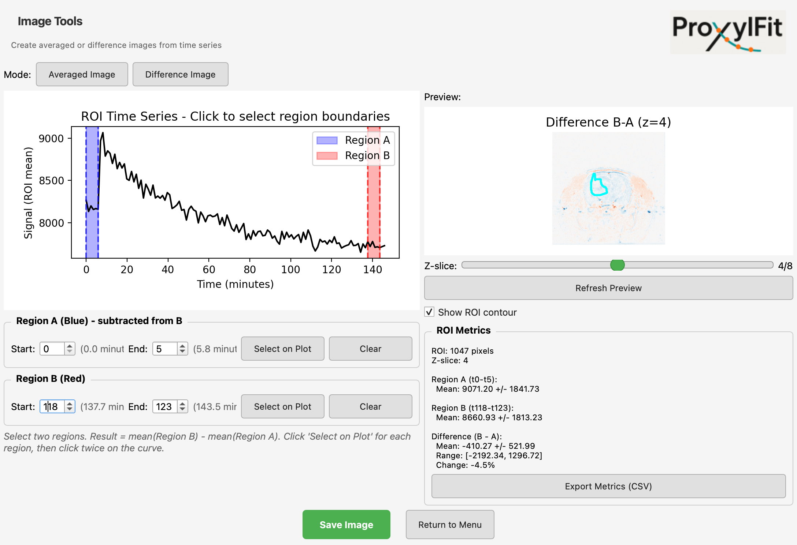

# ProxylFit Tutorial

## Launching the Application

```bash
cd ProxylFit
python -m proxyl_analysis
```

This opens the main menu. From here you can load data, draw ROIs, run analyses, and export results.

---

## Loading Data

### Option 1: Load from DICOM Folder (Recommended)

Click **"Load from DICOM Folder"** to scan a directory for DICOM series.



The scanner automatically identifies:
- **PROXYL series** (green) - T1 time series data
- **T2 series** (blue) - Structural T2 images

Select your T1 (PROXYL) series from the dropdown. Optionally select a T2 series for better ROI visualization. Click **"Load Selected"**.

### Option 2: Load Previous Session

To resume work on a previously registered dataset:
1. Click **"Load Previous Session"**
2. Navigate to `output/{dataset_name}/`
3. Click "Select Folder"

Your registered data and T2 (if any) will be restored automatically.

---

## Registration

After loading, registration runs automatically. The progress dialog shows real-time metrics:



- **Translation Magnitude** - How much each frame moved (should decrease over time)
- **Mean Squared Error** - Alignment quality (lower is better)

When complete, the review dialog appears:



**Panels (top row):**
- Reference (t=0) - The fixed reference frame
- Registered t=N - Current frame after alignment
- Difference - Should show minimal structure if well-aligned
- Original t=N - Before registration (for comparison)

**Navigation:**
- Use **arrow keys** or click plots to jump to specific timepoints
- Use **Z-slice** spinner to check different slices
- Click **"Accept Registration"** when satisfied

---

## Drawing an ROI

From the main menu, set your ROI options:
- **ROI Source**: T1 or T2 (T2 often shows tumors better)
- **ROI Method**: Contour (recommended), Rectangle, or Segment
- **Z-Slice**: Which slice to draw on

Click **"Draw ROI"** to open the contour dialog:



**To draw:**
1. Click and drag to draw around your region
2. Press **C** (or click "Close Contour") to complete the shape
3. Check the **Contour Statistics** panel for pixel count and intensity
4. Press **R** to reset and try again if needed
5. Click **"Accept ROI"** when done

**Tips:**
- Use the Z-Slice slider to verify your selection on adjacent slices
- The toolbar provides pan/zoom if needed

---

## Selecting Injection Time

After drawing the ROI, the injection time selector appears showing your ROI's signal over time.

**To select:**
1. Click on the timepoint where contrast was injected (signal starts rising)
2. Click **"Confirm"**

The kinetic model will fit data starting from this point.

---

## Running Kinetic Fit

Back in the main menu, click **"Run Kinetic Fit"**.

The results window shows:
- Fitted curve overlaid on your data
- Residuals plot
- Parameter table with uncertainties (kb, kd, knt, etc.)

Results are saved to `output/{dataset_name}/kinetic_results.txt`.

---

## Creating Parameter Maps

From the main menu, click **"Create Parameter Maps"**.

**Options dialog:**
- **Scope**: Single slice or all slices
- **ROI**: Reuse existing ROI, draw new one, or compute for entire image
- **Injection time**: Reuse from ROI analysis or select new

After computation, the results viewer opens:



**Features:**
- **Display dropdown** - Select which parameter to view (kb, kd, knt, R-squared, etc.)
- **Z-slice slider** - Navigate through slices
- **Show ROI contour** - Toggle ROI outline
- **Overlay opacity** - Adjust transparency

**Export options:**
- Save as DICOM - For viewing in medical imaging software
- Save as NPZ - NumPy format for further analysis
- Save as NIFTI - For neuroimaging tools
- Export Metrics (CSV) - Spreadsheet-friendly summary

---

## Creating Difference Images

From Image Tools, select **"Difference Image"** mode:



**To create a difference image:**

1. **Select Region A** (subtracted from):
   - Click "Select on Plot" under Region A
   - Click twice on the time curve to set start and end

2. **Select Region B** (subtracted):
   - Click "Select on Plot" under Region B
   - Click twice on the time curve to set start and end

3. **Preview** updates automatically showing B - A

4. Use **Z-slice** slider to check different slices

5. Click **"Save Image"** to export

**Common uses:**
- Pre vs post injection (enhancement)
- Early vs late timepoints (washout)

---

## Keyboard Shortcuts

| Dialog | Key | Action |
|--------|-----|--------|
| Contour ROI | C | Close contour |
| Contour ROI | R | Reset/clear |
| Contour ROI | Enter | Confirm selection |
| Segment ROI | T | Toggle +/- mode |
| Segment ROI | S | Run segmentation |
| Registration Review | Arrow keys | Navigate timepoints |
| Registration Review | Up/Down | Navigate Z-slices |

---

## Output Files

After analysis, results are saved in `output/{dataset_name}/`:

```
output/35354427/
├── registered/
│   ├── dicoms/                 # Registered T1 DICOM slices
│   │   ├── z00_t000.dcm
│   │   └── ...
│   │   └── T2/                 # Registered T2 (if loaded)
│   └── registration_metrics.json
├── parameter_maps/             # If generated
│   ├── kb_map.npz
│   └── ...
├── derived_images/             # Averaged/difference images
├── kinetic_fit.png
├── kinetic_results.txt
└── roi_timeseries.csv
```

---

## Troubleshooting

### "No registration data found"
Select the dataset folder (e.g., `output/35354427/`), not the `registered/` subfolder.

### T2 not showing as "Loaded"
T2 must be registered to T1. Use "Load T2 Volume" button or select T2 when loading from DICOM folder.

### ROI/Fit buttons are disabled
Draw an ROI and select injection time first.

### Registration is slow
First registration takes several minutes. Subsequent loads use cached data.

### Parameter mapping is slow
- Use smaller window size
- Use "Single Slice" mode
- Use "ROI Only" to limit computation area
